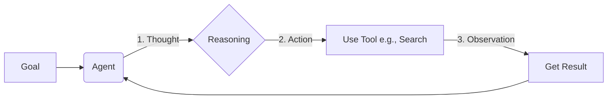

# 🚀 Welcome to the NeuraLife Developer Docs

This is your starting point for building, publishing, and monetizing next-generation AI agents on the world's first Agentic AI Marketplace.

Here, you'll learn how to use the **NeuraLife Agent Development Kit (ADK)** to transform your ideas into powerful, autonomous AI systems.

---

## 🎯 What is an AI Agent?

Unlike a traditional LLM that only responds to prompts, an AI Agent can **reason, plan, and act** to achieve a goal. It's a system that operates in a continuous loop:

> **Thought → Action → Observation → Thought...**

This allows agents to tackle complex tasks like conducting research, managing projects, or automating business workflows.

 

---

## ✨ Why Build on NeuraLife?

We provide the tools and the platform to turn your academic projects and creative ideas into real-world products.

| Feature                   | Your Advantage                                                                 |
| :------------------------ | :----------------------------------------------------------------------------- |
| 💰 **Monetize Instantly** | Earn revenue from day one through AdSense integration on your agent's page.    |
| 🚀 **Scale to a Startup** | High-traction agents get noticed. We incubate and connect you with investors.  |
| 🔍 **Get Discovered**     | Your live agent profile acts as a powerful, interactive resume for recruiters. |
| 🏢 **Solve B2B Problems** | Build custom agents for businesses and earn development fees.                  |

---

Ready to get started? Let's set up your environment.

**📚 Next: [Setup Environment](./setup) →**
